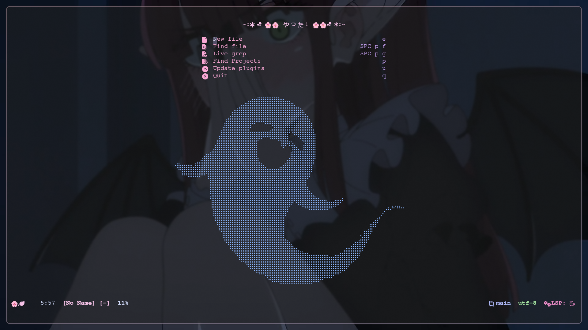

# 🌸🌸neovim config🌸🌸



- file structre

```bash

~/.config/nvim/lua

.
├── README.md
├── LICENSE.md
├── init.lua
├── lua
│   └── mistuba_Takanashi
│       ├── bootstrap.lua
│       ├── competion
│       │   └── competion.lua
│       ├── icons
│       │   ├── default.lua
│       │   └── listchars.lua
│       ├── init.lua
│       ├── lsp
│       │   ├── init.lua
│       │   ├── lsp_conf
│       │   │   ├── jsonls.lua.template
│       │   │   ├── lua_ls.lua
│       │   │   └── pyright.lua
│       │   └── lspconfig.lua
│       ├── plugins
│       │   ├── alpha.lua
│       │   ├── cmp.lua
│       │   ├── colorizer.lua
│       │   ├── colorschemes.lua
│       │   ├── comment.lua
│       │   ├── conform.lua
│       │   ├── gitsigns.lua
│       │   ├── harpoon.lua
│       │   ├── indent-blankline.lua
│       │   ├── lazydev.lua
│       │   ├── lsp-mason-bundle.lua
│       │   ├── lualine.lua
│       │   ├── navic-bundle.lua
│       │   ├── neo-tree.lua
│       │   ├── nvim-lint.lua
│       │   ├── nvim-ufo.lua
│       │   ├── statuscol.lua
│       │   ├── telescope.lua
│       │   ├── toggleterm.lua
│       │   ├── treesitter.lua
│       │   ├── trouble.lua
│       │   └── which-key.lua
│       └── setup
│           ├── mappings.lua
│           ├── options.lua
│           └── utils.lua
├── lazy-lock.json
└── assets
    └── nvim_alpha_dashboard_preview.png

9 directories, 38 files


```

## dependencey

option dependencies
`sudo pacman -S ripgrep`

## backeup your config

```bash
mv ~/.config/nvim ~/.config/nvim.bak
mv ~/.local/share/nvim ~/.local/share/nvim.bak
```

## setup

- create needed dir if not present

```bash
mkdir -p ~/.config/nvim/ && cd ~/.config/nvim/
```

- clone repo

```bash
git clone --depth=1 https://github.com/Himanshu-Parangat/mistuba_nvim ~/.config/nvim/
```

## removal

```bash
rm -r ~/.config/nvim
rm -r ~/.local/share/nvim
```

## Features ✨

> - **Completion**: auto-completions as you code, thanks to plugin `nvim-cmp`
> - **LSP (Language Server Protocol)**: Full integration with LSP servers for features like go-to definition, hover info, and code actions. by `nvim-lspconfig`.
> - **Which-key**: showing a helpful popup of all the available keybindings in the current context.
> - **Themes**: A beautiful, Catppuccin theme 
> - **Telescope**: Find files, buffers, and everything else `telescope.nvim` provides fast, fuzzy searching.
> - **Harpoon**: Jump between your most-used files with ease. `Harpoon`
> - **Indent Lines**: visual indent guides, using `indent-blankline.nvim`.
> - **Code Folding**:collapse and expand sections of your code without ugly fold numbers.


## todo

- rework on lsp keybind
- rework completion key press 
- setup spell check
- setup undo tree
- better diff
- gitsigns keybinds
- image preview
- json schema
- setup debug adapter
- setup org mode `(optional)`
- keymap "ds" conflict
- check for {{}} and CMP 
