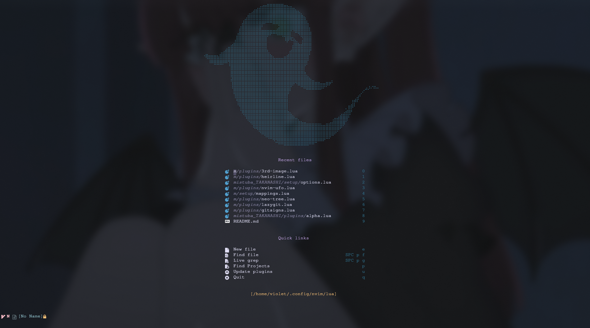

# 🌸🌸neovim config🌸🌸

 


* file structre

```bash

~/.config/nvim/lua
.
├── assets
│   └── nvim_alpha_preview.png
├── LICENSE
├── mistuba_TAKANASHI
│   ├── bootstrap.lua
│   ├── init.lua
│   ├── plugins
│   │   ├── 3rd-image.lua
│   │   ├── alpha.lua
│   │   ├── gitsigns.lua
│   │   ├── harpoon.lua
│   │   ├── heirline.lua
│   │   ├── lazygit.lua
│   │   ├── lsp-config.lua
│   │   ├── neo-tree.lua
│   │   ├── nvim-colorizer.lua
│   │   ├── nvim-telescope.lua
│   │   ├── nvim-treesitter.lua
│   │   ├── nvim-ufo.lua
│   │   ├── rose-pine.lua
│   │   ├── undotree.lua
│   │   └── which-key.lua
│   └── setup
│       ├── mappings.lua
│       └── options.lua
└── README.md

5 directories, 22 files

```

## dependencey

magick for image preview
`sudo luarocks --lua-version=5.1 install magick`

option dependencies
`sudo pacman -S lua51 luajit ripgrep lazygit`

## backeup your config
``` bash 
mv ~/.config/nvim ~/.config/nvim.bak
mv ~/.local/share/nvim ~/.local/share/nvim.bak
```
=======

## setup 

* create needed dir if not present 
```bash
mkdir -p ~/.config/nvim/lua && cd ~/.config/nvim/lua
```

* clone repo
```bash
git clone --depth=1 https://github.com/Himanshu-Parangat/mistuba_nvim ~/.config/nvim/lua
```

* require the new user config 
```bash
echo 'require("mistuba_TAKANASHI")' >> ~/.config/nvim/init.lua
```

## removal 
```bash
rm -r ~/.config/nvim 
rm -r ~/.local/share/nvim 
```


## todo 
* setup which key
* setup undo tree
* setup statusline
* setup lsp
* setup debug adapter


## 🚧 note 🚧 
>>This repository is currently under construction. 
Some features may be incomplete, and changes are expected to occur.
Please check back later for updates.
